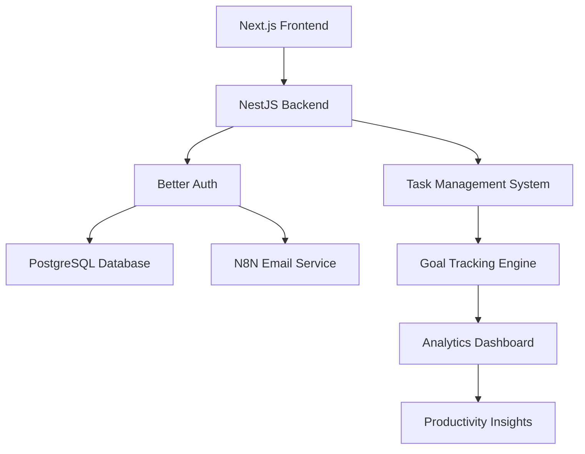

# 📈 Personal Productivity App

A comprehensive personal productivity platform built with Better Auth, featuring secure user management, task organization, goal tracking, and productivity analytics.

## 📁 Project Structure

```
personal-productivity-app/
├── backend/          # NestJS backend with Better Auth
├── frontend/         # Next.js frontend application
└── README.md         # This file
```

## 🚀 Quick Start

### Prerequisites

- Node.js 20+
- Docker & Docker Compose
- PostgreSQL (via Docker)

### 1. Backend Setup

```bash
cd backend

# Install dependencies
npm install

# Start with Docker (recommended)
docker-compose up -d

# Or start manually
npm run start:dev
```

**Backend runs on**: `http://localhost:3002`

### 2. Frontend Setup

```bash
cd frontend

# Install dependencies
npm install

# Start development server
npm run dev
```

**Frontend runs on**: `http://localhost:3000`

## ✨ Features

### 🔐 Secure Authentication

- ✅ Email/Password authentication
- ✅ Email OTP verification
- ✅ Password reset with OTP
- ✅ Social login (Google, Microsoft)
- ✅ Two-factor authentication
- ✅ Session management

### 📝 Task Management

- 📋 Smart task organization
- ⏰ Due date tracking
- 🏷️ Task categorization
- ✅ Progress monitoring
- 📊 Productivity insights

### 🎯 Goal Setting & Tracking

- 🎯 SMART goal creation
- 📈 Progress visualization
- 🏆 Achievement milestones
- 📅 Timeline management
- 📊 Success analytics

### 📊 Productivity Analytics

- 📈 Performance dashboards
- ⏱️ Time tracking insights
- 🔥 Productivity streaks
- 📋 Task completion rates
- 🎯 Goal achievement metrics

### 📧 Email Integration

- ✅ N8N webhook integration
- ✅ OTP email delivery
- ✅ Task reminders
- ✅ Goal milestone notifications

## 📚 Documentation

### Backend Documentation

- [`working-api.md`](./backend/working-api.md) - Complete API documentation with tested endpoints
- [`ORGANIZATION_SYSTEM.md`](./backend/ORGANIZATION_SYSTEM.md) - User management system architecture
- [`ROLES_AND_PERMISSIONS_SUMMARY.md`](./backend/ROLES_AND_PERMISSIONS_SUMMARY.md) - User role management guide
- [`PRODUCTION_CHECKLIST.md`](./backend/PRODUCTION_CHECKLIST.md) - Production deployment guide

### Key Configuration Files

- [`backend/src/auth/auth.config.ts`](./backend/src/auth/auth.config.ts) - Better Auth configuration
- [`frontend/lib/auth-client.ts`](./frontend/lib/auth-client.ts) - Frontend auth client
- [`frontend/lib/permissions.ts`](./frontend/lib/permissions.ts) - Permission validation

## 🛠️ Technology Stack

### Backend

- **Framework**: NestJS
- **Authentication**: Better Auth
- **Database**: PostgreSQL + Prisma ORM
- **Email**: N8N Webhook Integration
- **Containerization**: Docker

### Frontend

- **Framework**: Next.js 15
- **Styling**: Tailwind CSS
- **Authentication**: Better Auth React Client
- **UI Components**: Custom component library
- **TypeScript**: Full type safety

## 🔧 Environment Configuration

### Backend Environment Variables

```bash
# Database
DATABASE_URL=postgresql://postgres:password@db:5432/auth_service
POSTGRES_USER=postgres
POSTGRES_PASSWORD=password
POSTGRES_DB=auth_service

# Better Auth
BETTER_AUTH_SECRET=your-secret-key
BETTER_AUTH_URL=http://localhost:3002

# Email Service
N8N_WEBHOOK_URL=https://your-n8n-instance/webhook/auth-email-webhook

# OAuth (Optional)
GOOGLE_CLIENT_ID=your-google-client-id
GOOGLE_CLIENT_SECRET=your-google-client-secret
MICROSOFT_CLIENT_ID=your-microsoft-client-id
MICROSOFT_CLIENT_SECRET=your-microsoft-client-secret
```

### Frontend Environment Variables

```bash
NEXT_PUBLIC_AUTH_URL=http://localhost:3002
```

## 🧪 Testing

### API Testing

All endpoints have been thoroughly tested. See [`backend/working-api.md`](./backend/working-api.md) for:

- ✅ 15+ tested endpoints
- ✅ Complete request/response examples
- ✅ Error handling scenarios
- ✅ Performance metrics

### Test Results Summary

- **Success Rate**: 100% for configured endpoints
- **Response Times**: <200ms average
- **Error Handling**: Comprehensive error codes
- **Security**: CORS, validation, and session management tested

## 🚀 Deployment

### Development

```bash
# Backend
cd backend && docker-compose up -d

# Frontend
cd frontend && npm run dev
```

### Production

```bash
# Backend
cd backend && docker-compose -f docker-compose.prod.yml up -d

# Frontend
cd frontend && npm run build && npm start
```

See [`backend/PRODUCTION_CHECKLIST.md`](./backend/PRODUCTION_CHECKLIST.md) for complete production setup guide.

## 🔒 Security Features

- ✅ **CORS Protection** - Configured for allowed origins
- ✅ **Session Security** - HTTP-only cookies
- ✅ **Input Validation** - Comprehensive request validation
- ✅ **SQL Injection Protection** - Prisma ORM
- ✅ **Rate Limiting** - Built-in Better Auth protection
- ✅ **Email Verification** - Required for new accounts
- ✅ **Password Hashing** - Secure password storage
- ✅ **OTP Expiration** - Time-limited verification codes

## 📊 System Architecture



## 🤝 Contributing

1. Fork the repository
2. Create a feature branch
3. Make your changes
4. Test thoroughly
5. Submit a pull request

## 📄 License

This project is licensed under the MIT License.

## 🆘 Support

For issues and questions:

1. Check the documentation in [`backend/working-api.md`](./backend/working-api.md)
2. Review the user management guide in [`backend/ORGANIZATION_SYSTEM.md`](./backend/ORGANIZATION_SYSTEM.md)
3. Check the production checklist in [`backend/PRODUCTION_CHECKLIST.md`](./backend/PRODUCTION_CHECKLIST.md)

---

**🎉 Ready to boost your productivity with comprehensive task management and goal tracking!**

Built with ❤️ using Better Auth, NestJS, and Next.js
