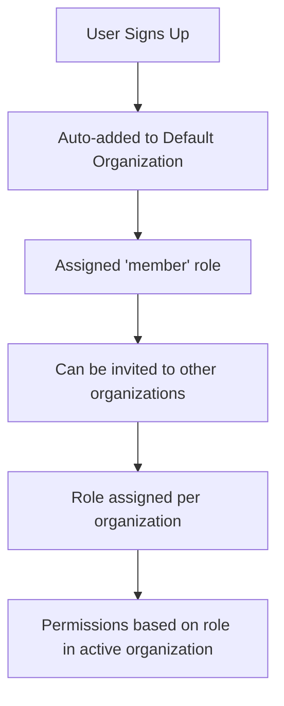

# Organization System & Role Management

## Overview

The auth backend implements a comprehensive multi-tenant organization system with role-based access control (RBAC). Here's how it works:

## Current Architecture

### 1. **Access Control System**

The system uses Better Auth's access control plugin to define resources and permissions:

```typescript
// Resources and their available actions
const statement = {
  user: ["create", "read", "update", "delete"],
  organization: ["update", "delete"],
  member: ["create", "update", "delete"],
  invitation: ["create", "cancel"],
} as const;
```

### 2. **Default Roles**

Currently, there are 3 predefined roles:

#### **Owner Role**

- **Full Access**: All permissions on all resources
- **Can do**: Create/manage users, update/delete organizations, manage members, send invitations
- **Use case**: Organization creator, super admin

#### **Admin Role**

- **Almost Full Access**: Most permissions except organization deletion
- **Can do**: Create/manage users, update organizations, manage members, send invitations
- **Cannot do**: Delete organizations
- **Use case**: Organization administrators

#### **Member Role**

- **Limited Access**: Read-only access to user information
- **Can do**: View user profiles
- **Cannot do**: Manage organization, invite users, modify settings
- **Use case**: Regular organization members

### 3. **Organization Flow**



### 4. **Database Structure**

```sql
-- Organizations table
Organization {
  id: string
  name: string
  slug: string (unique)
  logo: string?
  metadata: string?
  createdAt: DateTime
}

-- Members table (junction table)
Member {
  id: string
  userId: string
  organizationId: string
  role: string  -- 'owner', 'admin', 'member', or custom role
  createdAt: DateTime
}

-- Invitations table
Invitation {
  id: string
  email: string
  inviterId: string
  organizationId: string
  role: string
  status: string  -- 'pending', 'accepted', 'rejected'
  createdAt: DateTime
  expiresAt: DateTime
}
```

## How to Create Custom Roles

### Step 1: Define New Role in Backend

Edit `auth-backend/src/auth/auth.config.ts`:

```typescript
// Add new permissions to the statement if needed
const statement = {
  user: ["create", "read", "update", "delete"],
  organization: ["update", "delete"],
  member: ["create", "update", "delete"],
  invitation: ["create", "cancel"],
  // Add new resources if needed
  reports: ["create", "read", "update", "delete"],
  billing: ["read", "update"],
} as const;

const ac = createAccessControl(statement);

// Define existing roles...
const owner = ac.newRole({
  user: ["create", "read", "update", "delete"],
  organization: ["update", "delete"],
  member: ["create", "update", "delete"],
  invitation: ["create", "cancel"],
  reports: ["create", "read", "update", "delete"],
  billing: ["read", "update"],
});

// Create new custom roles
const manager = ac.newRole({
  user: ["read", "update"],
  organization: ["update"],
  member: ["create", "update"],
  invitation: ["create", "cancel"],
  reports: ["create", "read", "update"],
  billing: ["read"],
});

const viewer = ac.newRole({
  user: ["read"],
  organization: [],
  member: [],
  invitation: [],
  reports: ["read"],
  billing: ["read"],
});

const billing_admin = ac.newRole({
  user: ["read"],
  organization: [],
  member: [],
  invitation: [],
  reports: ["read"],
  billing: ["read", "update"],
});

// Add roles to organization plugin
organization({
  ac,
  roles: {
    owner,
    admin: adminRole,
    member,
    manager, // New role
    viewer, // New role
    billing_admin, // New role
  },
  // ... rest of config
});
```

### Step 2: Update Frontend Permissions

Edit `auth-frontend/lib/permissions.ts`:

```typescript
// Add new resources if you added them in backend
export const permissions = {
  user: ["create", "read", "update", "delete"] as const,
  organization: ["update", "delete"] as const,
  member: ["create", "update", "delete"] as const,
  invitation: ["create", "cancel"] as const,
  reports: ["create", "read", "update", "delete"] as const,
  billing: ["read", "update"] as const,
} as const;

// Update permission checker
export function hasPermission(
  resource: PermissionResource,
  action: string,
  userRole?: string
): boolean {
  // Owner has all permissions
  if (userRole === "owner") {
    return true;
  }

  // Admin has most permissions except org deletion
  if (userRole === "admin") {
    if (resource === "organization" && action === "delete") {
      return false;
    }
    return (permissions[resource] as readonly string[]).includes(action);
  }

  // Manager role
  if (userRole === "manager") {
    const managerPermissions = {
      user: ["read", "update"],
      organization: ["update"],
      member: ["create", "update"],
      invitation: ["create", "cancel"],
      reports: ["create", "read", "update"],
      billing: ["read"],
    };
    return ((managerPermissions[resource] as string[]) || []).includes(action);
  }

  // Viewer role
  if (userRole === "viewer") {
    const viewerPermissions = {
      user: ["read"],
      reports: ["read"],
      billing: ["read"],
    };
    return ((viewerPermissions[resource] as string[]) || []).includes(action);
  }

  // Billing admin role
  if (userRole === "billing_admin") {
    const billingAdminPermissions = {
      user: ["read"],
      reports: ["read"],
      billing: ["read", "update"],
    };
    return ((billingAdminPermissions[resource] as string[]) || []).includes(
      action
    );
  }

  // Member has read-only access
  if (userRole === "member") {
    return resource === "user" && action === "read";
  }

  return false;
}
```

### Step 3: Update Frontend Components

Update your frontend components to use the new roles:

```typescript
// In your React components
import { hasPermission } from '@/lib/permissions';

function DashboardPage() {
  const { data: session } = useSession();
  const userRole = session?.user?.role || 'member';

  const canManageReports = hasPermission('reports', 'create', userRole);
  const canViewBilling = hasPermission('billing', 'read', userRole);
  const canManageBilling = hasPermission('billing', 'update', userRole);

  return (
    <div>
      {canManageReports && (
        <button>Create Report</button>
      )}

      {canViewBilling && (
        <Link href="/billing">View Billing</Link>
      )}

      {canManageBilling && (
        <button>Manage Billing</button>
      )}
    </div>
  );
}
```

## Role Assignment Examples

### 1. **Assign Role During Invitation**

```bash
curl -X POST http://localhost:3002/api/auth/organization/invite-member \
  -H "Content-Type: application/json" \
  -H "Origin: http://localhost:3000" \
  -H "Cookie: better-auth.session_token=your_token" \
  -d '{
    "email": "manager@example.com",
    "role": "manager"
  }'
```

### 2. **Update Member Role**

```bash
curl -X POST http://localhost:3002/api/auth/organization/update-member-role \
  -H "Content-Type: application/json" \
  -H "Origin: http://localhost:3000" \
  -H "Cookie: better-auth.session_token=your_token" \
  -d '{
    "memberId": "member_123456789",
    "role": "billing_admin"
  }'
```

### 3. **Add User to Organization with Custom Role**

```bash
curl -X POST http://localhost:3002/organization/add-to-default \
  -H "Content-Type: application/json" \
  -d '{
    "userId": "user_123456789",
    "role": "viewer"
  }'
```

## Advanced Role Patterns

### 1. **Hierarchical Roles**

```typescript
// Define role hierarchy
const roleHierarchy = {
  owner: 5,
  admin: 4,
  manager: 3,
  member: 2,
  viewer: 1,
};

export function hasHigherRole(userRole: string, requiredRole: string): boolean {
  return (roleHierarchy[userRole] || 0) >= (roleHierarchy[requiredRole] || 0);
}
```

### 2. **Context-Specific Permissions**

```typescript
export function hasContextPermission(
  resource: string,
  action: string,
  userRole: string,
  context?: { organizationId?: string; isOwner?: boolean }
): boolean {
  // Check if user is organization owner
  if (context?.isOwner) {
    return true;
  }

  // Regular permission check
  return hasPermission(resource, action, userRole);
}
```

### 3. **Dynamic Role Assignment**

```typescript
// In your organization hooks
organizationHooks: {
  afterAddMember: async ({ member, user, organization }) => {
    // Auto-assign role based on user attributes
    let role = 'member';

    if (user.email.endsWith('@company.com')) {
      role = 'manager';
    } else if (user.role === 'admin') {
      role = 'admin';
    }

    // Update member role if needed
    if (member.role !== role) {
      await updateMemberRole(member.id, role);
    }
  },
}
```

## Testing Custom Roles

### 1. **Create Test Users with Different Roles**

```bash
# Create users and assign roles
curl -X POST http://localhost:3002/api/auth/sign-up/email \
  -d '{"email":"manager@test.com","password":"Test123!","name":"Manager User"}'

curl -X POST http://localhost:3002/organization/add-to-default \
  -d '{"userId":"user_id_here","role":"manager"}'
```

### 2. **Test Permissions**

```bash
# Test what a manager can do
curl -X GET http://localhost:3002/api/auth/organization/list-members \
  -H "Cookie: better-auth.session_token=manager_token"

# Test what a viewer cannot do
curl -X POST http://localhost:3002/api/auth/organization/invite-member \
  -H "Cookie: better-auth.session_token=viewer_token" \
  -d '{"email":"test@example.com","role":"member"}'
```

## Best Practices

### 1. **Role Naming Convention**

- Use descriptive names: `billing_admin`, `content_manager`, `read_only_user`
- Avoid generic names: `role1`, `type_a`, `level_3`

### 2. **Permission Granularity**

- Start with broad permissions, then refine
- Consider future needs when defining resources
- Group related actions together

### 3. **Security Considerations**

- Always validate permissions on the backend
- Don't rely solely on frontend permission checks
- Log permission changes for audit trails

### 4. **Testing Strategy**

- Test each role with different scenarios
- Verify permission inheritance works correctly
- Test edge cases and boundary conditions

---

## Current System Status

✅ **Working Features:**

- Multi-tenant organization system
- Role-based access control
- Automatic organization assignment
- Invitation system with role assignment
- Permission validation

⚠️ **Limitations:**

- Fixed role definitions (requires code changes)
- No runtime role creation
- No role inheritance system

🚀 **Potential Enhancements:**

- Dynamic role creation via API
- Role templates and inheritance
- Audit logging for permission changes
- Time-based role assignments
- Resource-specific permissions

---

This system provides a solid foundation for multi-tenant applications with flexible role management!
