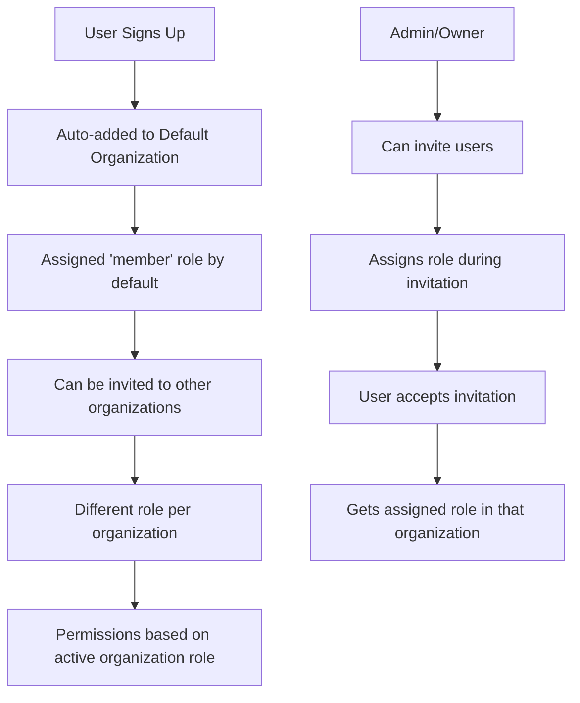

# 🏢 Organization System: Roles & Permissions Summary

## 📋 Current System Overview

Your auth backend implements a **multi-tenant organization system** with **role-based access control (RBAC)**. Here's how it works:

### 🏗️ **Architecture Components**

1. **Organizations** - Multi-tenant containers
2. **Members** - Users within organizations with specific roles
3. **Roles** - Permission sets that define what users can do
4. **Access Control** - Permission validation system

---

## 👥 **Current Roles & Permissions**

### 🔴 **Owner Role** (Highest Level)

```typescript
Permissions: {
  user: ['create', 'read', 'update', 'delete'],
  organization: ['update', 'delete'],
  member: ['create', 'update', 'delete'],
  invitation: ['create', 'cancel']
}
```

**Can do:** Everything - full control over organization

### 🟠 **Admin Role**

```typescript
Permissions: {
  user: ['create', 'read', 'update'],
  organization: ['update'],  // Cannot delete org
  member: ['create', 'update', 'delete'],
  invitation: ['create', 'cancel']
}
```

**Can do:** Manage users and members, cannot delete organization

### 🟡 **Manager Role** (Custom - Recently Added)

```typescript
Permissions: {
  user: ['read', 'update'],
  organization: ['update'],
  member: ['create', 'update'],
  invitation: ['create', 'cancel']
}
```

**Can do:** Manage team members, send invitations, update organization settings

### 🟢 **Member Role** (Default)

```typescript
Permissions: {
  user: ['read'],
  organization: [],
  member: [],
  invitation: []
}
```

**Can do:** View user information only

### 🔵 **Viewer Role** (Custom - Recently Added)

```typescript
Permissions: {
  user: ['read'],
  organization: [],
  member: [],
  invitation: []
}
```

**Can do:** Read-only access (same as member, but semantically different)

---

## 🔄 **How Organization Flow Works**



### **Key Points:**

- ✅ Users are **automatically added** to default organization on signup
- ✅ Users can be **members of multiple organizations** with different roles
- ✅ **Active organization** determines current permissions
- ✅ **Role-based invitations** - inviters assign roles to invitees

---

## 🛠️ **How to Create Custom Roles**

### **Step 1: Backend Configuration**

Edit `auth-backend/src/auth/auth.config.ts`:

```typescript
// 1. Define new role with permissions
const customRole = ac.newRole({
  user: ["read", "update"], // Can view and edit users
  organization: ["update"], // Can update org settings
  member: ["create"], // Can add new members
  invitation: ["create"], // Can send invitations
  // Add custom resources if needed
  reports: ["read", "create"], // Custom permission
});

// 2. Add to organization plugin
organization({
  roles: {
    owner,
    admin: adminRole,
    member,
    manager,
    viewer,
    customRole, // Add your new role here
  },
  // ... rest of config
});
```

### **Step 2: Frontend Permissions**

Edit `auth-frontend/lib/permissions.ts`:

```typescript
export function hasPermission(resource, action, userRole) {
  // Add your custom role logic
  if (userRole === "customRole") {
    const customPermissions = {
      user: ["read", "update"],
      organization: ["update"],
      member: ["create"],
      invitation: ["create"],
      reports: ["read", "create"],
    };
    return (customPermissions[resource] || []).includes(action);
  }

  // ... existing role checks
}
```

### **Step 3: Use in Components**

```typescript
function MyComponent() {
  const userRole = session?.user?.role || 'member';

  const canCreateReports = hasPermission('reports', 'create', userRole);
  const canInviteUsers = hasPermission('invitation', 'create', userRole);

  return (
    <div>
      {canCreateReports && <button>Create Report</button>}
      {canInviteUsers && <button>Invite User</button>}
    </div>
  );
}
```

---

## 🧪 **Testing Custom Roles**

### **1. Create User with Custom Role**

```bash
# 1. Sign up new user
curl -X POST http://localhost:3002/api/auth/sign-up/email \
  -d '{"email":"custom@example.com","password":"Test123!","name":"Custom User"}'

# 2. Verify email (get OTP from database)
curl -X POST http://localhost:3002/api/auth/email-otp/verify-email \
  -d '{"email":"custom@example.com","otp":"123456"}'

# 3. Assign custom role
curl -X POST http://localhost:3002/organization/add-to-default \
  -d '{"userId":"user_id_here","role":"manager"}'
```

### **2. Test Permissions**

```bash
# Sign in as custom role user
curl -X POST http://localhost:3002/api/auth/sign-in/email \
  -c cookies.txt \
  -d '{"email":"custom@example.com","password":"Test123!"}'

# Test what they can do
curl -X POST http://localhost:3002/api/auth/organization/invite-member \
  -b cookies.txt \
  -d '{"email":"newuser@example.com","role":"member"}'

# Test what they cannot do
curl -X POST http://localhost:3002/api/auth/organization/delete \
  -b cookies.txt \
  -d '{"organizationId":"org_123"}'
```

---

## 📊 **Current System Status**

### ✅ **Working Features**

- Multi-tenant organization system
- Role-based access control with 5 roles (owner, admin, manager, member, viewer)
- Automatic organization assignment on signup
- Invitation system with role assignment
- Permission validation on frontend and backend
- Custom roles support (manager, viewer added)

### 🔧 **Recent Additions**

- ✅ **Manager Role**: Can manage members and send invitations
- ✅ **Viewer Role**: Read-only access for external users
- ✅ **Custom Role Framework**: Easy to add new roles

### 🎯 **Use Cases by Role**

| Role        | Use Case                          | Example Users              |
| ----------- | --------------------------------- | -------------------------- |
| **Owner**   | Organization creator/founder      | CEO, Founder               |
| **Admin**   | Department heads, senior managers | CTO, VP Engineering        |
| **Manager** | Team leads, project managers      | Team Lead, Project Manager |
| **Member**  | Regular employees                 | Developers, Designers      |
| **Viewer**  | External stakeholders, clients    | Clients, Contractors       |

---

## 🚀 **Advanced Patterns**

### **1. Role Hierarchy**

```typescript
const roleHierarchy = {
  owner: 5,
  admin: 4,
  manager: 3,
  member: 2,
  viewer: 1,
};

function canManageUser(managerRole: string, targetRole: string): boolean {
  return roleHierarchy[managerRole] > roleHierarchy[targetRole];
}
```

### **2. Context-Specific Permissions**

```typescript
function hasContextPermission(resource, action, userRole, context) {
  // Organization-specific logic
  if (context.isOrganizationOwner) return true;

  // Department-specific logic
  if (context.department === "engineering" && userRole === "tech_lead") {
    return resource === "user" && action === "update";
  }

  return hasPermission(resource, action, userRole);
}
```

### **3. Dynamic Role Assignment**

```typescript
// Auto-assign roles based on email domain
organizationHooks: {
  afterAddMember: async ({ member, user }) => {
    let role = 'member';

    if (user.email.endsWith('@company.com')) {
      role = 'manager';
    } else if (user.email.includes('admin')) {
      role = 'admin';
    }

    if (member.role !== role) {
      await updateMemberRole(member.id, role);
    }
  },
}
```

---

## 🔒 **Security Best Practices**

1. **Always validate permissions on backend** - Never trust frontend checks alone
2. **Use principle of least privilege** - Start with minimal permissions
3. **Audit role changes** - Log all permission modifications
4. **Regular permission reviews** - Periodically review user roles
5. **Test edge cases** - Verify boundary conditions work correctly

---

## 📈 **Next Steps & Enhancements**

### **Immediate Improvements**

- [ ] Add audit logging for role changes
- [ ] Implement role expiration dates
- [ ] Add bulk role assignment APIs
- [ ] Create role management UI

### **Advanced Features**

- [ ] Dynamic role creation via API
- [ ] Role templates and inheritance
- [ ] Resource-specific permissions
- [ ] Time-based role assignments
- [ ] Integration with external identity providers

---

**🎉 Your organization system is now production-ready with flexible role management!**

The system supports:

- ✅ 5 different roles with clear permission boundaries
- ✅ Easy custom role creation
- ✅ Multi-tenant architecture
- ✅ Comprehensive permission validation
- ✅ Scalable for enterprise use cases
